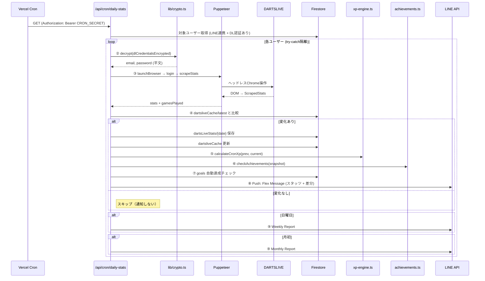

:::message
この記事は「**設計図 × コードで読み解くサービス連携**」シリーズの第3回です。
毎朝 01:00 UTC（JST 10:00）に走る Cron バッチが、6つのサービスをまたいで9ステップを実行する仕組みを実コードで追います。
:::

> 🔗 **インタラクティブ設計図**: [Cronバッチタブを見る](https://seiryuu-portfolio.vercel.app/projects/darts-lab)

---

## 1. 設計図で見る全体像

```
Vercel Cron (01:00 UTC)
  → ① /api/cron/daily-stats (Bearer認証)
  → ② lib/crypto.ts (AES-256-GCM復号)
  → ③ lib/dartslive-scraper.ts (Puppeteer → DARTSLIVE)
  → ④ Firestore (dartsLiveStats, dartsliveCache) — 差分検出
  → ⑤ lib/progression/xp-engine.ts (XP計算)
  → ⑥ lib/progression/achievements.ts (実績判定)
  → ⑦ lib/goals.ts (目標自動達成)
  → ⑧ lib/line.ts (LINE Push通知 + Flex Message)
  → ⑨ 週報/月報（日曜/月初に追加送信）
```

6つのサービス: **Vercel Cron** / **DARTSLIVE** / **Firestore** / **LINE** / **Puppeteer（ヘッドレスChrome）** / **DARTSLIVE REST API**（admin向け）

---

## 2. この記事の重要用語

| 用語 | 一言説明 | この記事での役割 |
|------|---------|----------------|
| **Cron ジョブ** | 決まった時間に自動実行されるスケジュールタスク | Vercel が毎朝 01:00 UTC に API を叩く |
| **Puppeteer** | Node.js から Chrome を操作するライブラリ | DARTSLIVE サイトにログインしてスタッツを自動取得 |
| **ヘッドレスブラウザ** | 画面表示なしで動く Chrome。サーバーでの自動操作用 | Vercel 上でスクレイピングを実行する手段 |
| **AES-256-GCM** | 256bit 鍵の暗号化 + 改ざん検知がセットの暗号方式 | DARTSLIVE のログイン情報を暗号化して Firestore に保管 |
| **IV（初期化ベクトル）** | 暗号化のたびにランダム生成する値。同じ平文でも異なる暗号文になる | `encrypt()` で毎回 `randomBytes(12)` を生成 |
| **差分検出（Diff）** | 前回保存データと今回取得データを比較して変化を検出 | `dartsliveCache/latest` と比較 → 変化時のみ保存・通知 |
| **Flex Message** | LINE の構造化メッセージ。カード型の自由レイアウト | スタッツ差分を色分け表示して LINE に送信 |
| **Bearer Token** | HTTP ヘッダーに含める認証トークン | Cron API の呼び出し元が Vercel であることを検証 |

---

## 3. コードで追うデータフロー

### 3-1. 全9ステップの流れ



### 3-2. Bearer 認証（Step ①）

```typescript
// app/api/cron/daily-stats/route.ts
export const maxDuration = 300; // Vercel Pro: 最大300秒

export async function GET(request: NextRequest) {
  // Vercel Cron 認証
  const authHeader = request.headers.get('authorization');
  if (authHeader !== `Bearer ${process.env.CRON_SECRET}`) {
    return NextResponse.json({ error: 'Unauthorized' }, { status: 401 });
  }
  // ...
}
```

Vercel Cron は `vercel.json` の schedule で定義し、`CRON_SECRET` 環境変数で認証します。

### 3-3. AES-256-GCM 暗号化・復号（Step ②）

```typescript
// lib/crypto.ts
const ALGORITHM = 'aes-256-gcm';
const IV_LENGTH = 12;
const TAG_LENGTH = 16;

export function encrypt(plainText: string): string {
  const key = getKey(); // 環境変数から256bit鍵を取得
  const iv = randomBytes(IV_LENGTH); // ★ 毎回ランダム生成
  const cipher = createCipheriv(ALGORITHM, key, iv);
  const encrypted = Buffer.concat([cipher.update(plainText, 'utf8'), cipher.final()]);
  const tag = cipher.getAuthTag();
  // iv(12) + tag(16) + ciphertext を結合して base64
  return Buffer.concat([iv, tag, encrypted]).toString('base64');
}

export function decrypt(encrypted: string): string {
  const key = getKey();
  const buf = Buffer.from(encrypted, 'base64');
  const iv = buf.subarray(0, IV_LENGTH);        // 先頭12バイト
  const tag = buf.subarray(IV_LENGTH, IV_LENGTH + TAG_LENGTH); // 次の16バイト
  const ciphertext = buf.subarray(IV_LENGTH + TAG_LENGTH);     // 残り
  const decipher = createDecipheriv(ALGORITHM, key, iv);
  decipher.setAuthTag(tag);
  return decipher.update(ciphertext) + decipher.final('utf8');
}
```

```
┌─────────────── base64エンコード済み文字列 ───────────────┐
│  IV (12 bytes)  │  Auth Tag (16 bytes)  │  Ciphertext   │
│  ランダム生成    │  改ざん検知用          │  暗号化本文    │
└─────────────────┴───────────────────────┴───────────────┘
```

**なぜ GCM**: AES-CBC だと暗号化のみですが、GCM は **暗号化 + 認証（改ざん検知）** がセットです。Auth Tag で「復号結果が改ざんされていないか」を保証します。

### 3-4. Puppeteer スクレイピング（Step ③）

```typescript
// lib/dartslive-scraper.ts
export async function launchBrowser(): Promise<Browser> {
  const isVercel = process.env.VERCEL === '1';
  return puppeteer.launch({
    args: isVercel ? chromium.args : ['--no-sandbox', '--disable-setuid-sandbox'],
    executablePath: isVercel
      ? await chromium.executablePath() // @sparticuz/chromium（Vercel用軽量Chrome）
      : process.env.CHROME_PATH || '/Applications/.../Google Chrome',
    headless: true,
  });
}

export async function login(page: Page, email: string, password: string): Promise<boolean> {
  await page.goto('https://card.dartslive.com/account/login.jsp', {
    waitUntil: 'networkidle2', timeout: 15000,
  });
  await page.type('#text', email);
  await page.type('#password', password);
  await page.click('input[type="submit"]');
  await page.waitForNavigation({ waitUntil: 'networkidle2', timeout: 15000 });
  return !page.url().includes('login.jsp'); // ログイン成功判定
}
```

### 3-5. 差分検出と条件分岐（Step ④）

```mermaid
flowchart TD
    A[dartsliveCache/latest 取得] --> B{前回データと比較}
    B -->|rating, stats01Avg, statsCriAvg<br>いずれか変化| C[変化あり]
    B -->|すべて同じ| D[変化なし → スキップ]

    C --> E[dartsLiveStats/{date} 保存]
    E --> F[キャッシュ更新]
    F --> G[XP計算 + 実績判定]
    G --> H[LINE Push通知]

    H --> I{今日は日曜?}
    I -->|Yes| J[Weekly Report 追加送信]
    I -->|No| K{今日は月初?}
    K -->|Yes| L[Monthly Report 追加送信]
    K -->|No| M[完了]
```

```typescript
// 差分検出のロジック
const hasChange =
  !prevData ||
  prevData.rating !== stats.rating ||
  prevData.stats01Avg !== stats.stats01Avg ||
  prevData.statsCriAvg !== stats.statsCriAvg;
```

### 3-6. XP 自動付与（Step ⑤）

```typescript
// lib/progression/xp-engine.ts — calculateCronXp
export function calculateCronXp(
  prev: CronStatsSnapshot | null,
  current: CronStatsSnapshot,
): CronXpAction[] {
  const actions: CronXpAction[] = [];

  // Rating整数到達: 例 Rt.5.8 → Rt.6.2 = 1マイルストーン
  if (current.rating != null) {
    const prevFloor = p.rating != null ? Math.floor(p.rating) : 0;
    const curFloor = Math.floor(current.rating);
    if (curFloor > prevFloor) {
      actions.push({
        action: 'rating_milestone',
        xp: rule.xp * (curFloor - prevFloor),
        label: rule.label,
        count: curFloor - prevFloor,
      });
    }
  }

  // Award差分: HAT TRICK, TON 80, 3-BLACK... 各アワードの増加分
  // ★ 逓減リターン: 累計数が多いほど1回あたりの XP が減る
  for (const { key, ruleId } of awardDiffs) {
    const diff = (current[key] as number) - (p[key] as number);
    if (diff > 0) {
      const effectiveXp = getEffectiveXp(rule, cumulativeCount);
      if (effectiveXp > 0) {
        actions.push({ action: ruleId, xp: effectiveXp * diff, ... });
      }
    }
  }

  return actions;
}
```

XP ルールの内訳:

| カテゴリ | ルール例 | XP |
|---------|---------|-----|
| 基本 | stats_recorded（記録あり） | Cron で自動付与 |
| マイルストーン | rating_milestone（整数到達） | 50 XP |
| アワード | hat_trick, ton_80, 3_black 等 | 5-30 XP（逓減あり） |
| 継続 | streak系, weekly/monthly active | 25-100 XP |

### 3-7. try-catch によるユーザー隔離

```typescript
for (const userDoc of eligibleUsers) {
  try {
    // ユーザーごとの全処理
    const dlEmail = decrypt(userData.dlCredentialsEncrypted.email);
    // ... scraping, diff, XP, LINE ...
    results.push({ userId, status: 'notified' });
  } catch (err) {
    // ★ 1人の失敗で全員が止まらない
    console.error(`Cron error for user ${userId}:`, err);
    results.push({ userId, status: 'error', error: String(err) });
  }
}
```

### 3-8. フォールバック戦略

```typescript
if (userData.role === 'admin') {
  try {
    // admin: DARTSLIVE REST API を優先（高速・安定）
    apiSyncResult = await dlApiDiffSync(dlEmail, dlPassword, existingLastSync);
    stats = mapApiToScrapedStats(apiSyncResult);
  } catch (apiErr) {
    // API失敗 → Puppeteer にフォールバック
    const fallbackPage = await createPage(browser);
    stats = await withRetry(() => scrapeStats(fallbackPage));
  }
} else {
  // 非admin: 従来通り Puppeteer
  stats = await withRetry(() => scrapeStats(scraperPage));
}
```

| ロール | 1st手段 | フォールバック |
|--------|---------|--------------|
| admin | REST API（差分同期） | Puppeteer |
| pro/general | Puppeteer | withRetry（指数バックオフ 1s, 3s） |

---

## 4. 設計判断の背景

### なぜ API ではなくスクレイピングか

DARTSLIVE には **公式 API が存在しません**。スタッツを取得する唯一の手段が Web サイトへのログイン → DOM 解析です。admin のみ非公開の REST API（リバースエンジニアリングで発見）を使用しますが、安定性は保証されないため Puppeteer へのフォールバックを維持しています。

### なぜキャッシュ（dartsliveCache/latest）が必要か

Puppeteer によるスクレイピングは **30-60秒** かかります。ダッシュボード表示のたびにスクレイピングするのは現実的ではないため、Cron で1日1回取得した結果をキャッシュし、ダッシュボードはキャッシュを参照します（サブ秒レスポンス）。

### 各ユーザーの try-catch 隔離

ユーザー A の DARTSLIVE パスワードが変更されてログイン失敗しても、ユーザー B, C の処理は正常に続行します。1人の障害で **全員のバッチが止まる事態を防ぐ** ための設計です。

### ブラウザの共有

```typescript
const browser = await launchBrowser(); // 全ユーザーで1つのブラウザを共有
try {
  for (const userDoc of eligibleUsers) {
    const scraperPage = await createPage(browser); // ユーザーごとに新しいページ
    try {
      // ... scraping ...
    } finally {
      await scraperPage.close(); // ページは都度閉じる
    }
  }
} finally {
  await browser.close(); // 最後にブラウザを閉じる
}
```

Chrome の起動は重いため、ブラウザインスタンスは全ユーザーで共有し、ページ（タブ）だけをユーザーごとに開閉します。

---

## 5. 本（Book）との対応

- **第6章「Firestore 23コレクションの設計判断」**: `dartsliveCache`, `dartsLiveStats`, `xpHistory` の設計
- **第7章「AIとペアプロする日常」**: Cron バッチの実装過程での AI との協働

> 📘 [Zenn Book: AI × 個人開発で55,000行のSaaSを作った方法](https://zenn.dev/seiryuuu_dev/books/claude-code-darts-lab)

---

:::message
**次の記事**: [LINE Bot × ステートマシン](https://zenn.dev/seiryuuu_dev/articles/darts-lab-line-statemachine) — Webhook 受信から状態遷移・外部API連携までを追います。
:::
