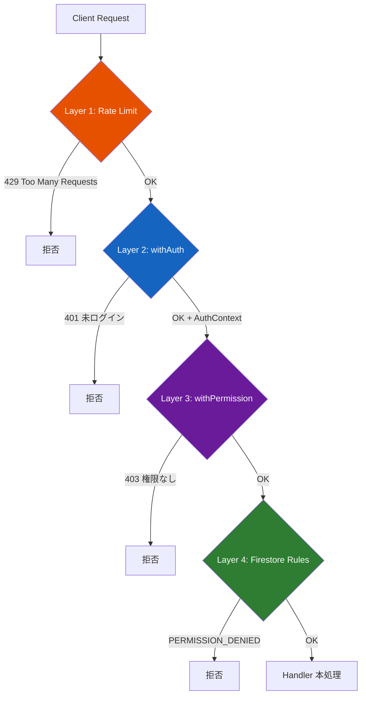
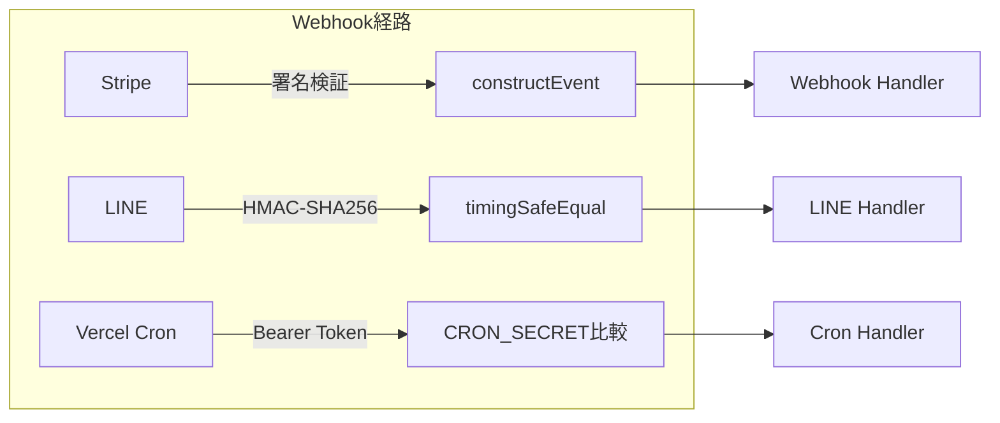

:::message
この記事は「**設計図 × コードで読み解くサービス連携**」シリーズの第5回（最終回）です。
リクエストがアプリケーションに到達してから本処理に到達するまでに通過する **4つのセキュリティ層** と、Webhook 系の別経路セキュリティを実コードで解説します。
:::

> 🔗 **インタラクティブ設計図**: [API・データフロータブ（セキュリティ層）を見る](https://seiryuu-portfolio.vercel.app/projects/darts-lab)

---

## 1. 設計図で見る全体像

```
Request
  → Layer 1: checkRateLimit (Upstash Redis / in-memory fallback)
  → Layer 2: withAuth (NextAuth getServerSession → JWT検証)
  → Layer 3: withPermission (lib/permissions.ts の関数チェック)
  → Layer 4: firestore.rules (クライアント直接アクセス時のガード)
  → Handler (本処理)
```

加えて、Webhook 系は **別経路のセキュリティ** で保護されています:

```
Stripe  → 署名検証 (constructEvent)
LINE    → HMAC-SHA256 + timingSafeEqual
Cron    → Bearer Token (CRON_SECRET)
```

---

## 2. この記事の重要用語

| 用語 | 一言説明 | この記事での役割 |
|------|---------|----------------|
| **多層防御** (Defense in Depth) | 1つの壁が突破されても次の壁で止める設計思想 | 4層のセキュリティチェックを重ねる根拠 |
| **レートリミット** | 一定時間内のリクエスト数を制限する仕組み | Layer 1: 60 req/min/IP で DDoS・ブルートフォースを抑制 |
| **スライディングウィンドウ** | 「直近60秒」のように時間枠がリクエストごとにスライドする方式 | Upstash Redis のレートリミットアルゴリズム |
| **SSRF** (Server-Side Request Forgery) | サーバーに内部ネットワークへのリクエストを実行させる攻撃 | セキュリティレビューで発見された CRITICAL 脆弱性 |
| **CSV Injection** | CSV に数式（=CMD等）を埋め込み、開いた人の PC で実行させる攻撃 | エクスポート機能で対策が必要だった |
| **Admin SDK** | Firebase のサーバー専用 SDK。Security Rules をバイパスする | role や XP など重要フィールドは Admin SDK 経由でのみ書き込み |
| **affectedKeys()** | Firestore ルールで「どのフィールドが変更されたか」を取得する関数 | ユーザーが role を自分で書き換えることを防ぐ |
| **CSP** (Content Security Policy) | ブラウザに「許可された外部リソースのみ読み込め」と指示するヘッダー | nonce 方式で XSS のリスクを低減 |

---

## 3. コードで追うデータフロー

### 3-1. 通常API — 4層の多層防御



### 3-2. Webhook 系の別経路



### 3-3. Layer 1: レートリミット（Redis優先 + in-memoryフォールバック）

```typescript
// lib/api-middleware.ts — checkRateLimit
export async function checkRateLimit(req: NextRequest): Promise<NextResponse | null> {
  const key = getRateLimitKey(req); // x-forwarded-for からIP取得

  // ★ Upstash Redis を優先
  const redisResult = await checkRedisRateLimit(key);
  if (redisResult) {
    if (!redisResult.success) {
      const retryAfter = Math.ceil((redisResult.reset - Date.now()) / 1000);
      return NextResponse.json(
        { error: 'Too many requests' },
        { status: 429, headers: { 'Retry-After': String(Math.max(retryAfter, 1)) } },
      );
    }
    return null; // OK
  }

  // ★ Redis 未設定時は in-memory フォールバック
  return checkInMemoryRateLimit(key);
}
```

```typescript
// lib/rate-limit.ts — Upstash Redis のスライディングウィンドウ
import { Ratelimit } from '@upstash/ratelimit';
import { Redis } from '@upstash/redis';

ratelimit = new Ratelimit({
  redis: new Redis({ url, token }),
  limiter: Ratelimit.slidingWindow(60, '1 m'), // 60 req/min/IP
  analytics: true,
  prefix: 'darts-app:ratelimit',
});
```

**なぜ2段構え**: Vercel Serverless はインスタンス間でメモリを共有できません。in-memory のみだと、インスタンスA に30回、インスタンスB に30回で合計60回突破されます。**Upstash Redis でグローバルに共有** し、Redis が使えない環境（ローカル開発等）では in-memory にフォールバックします。

### 3-4. Layer 2: withAuth（JWT セッション検証）

```typescript
// lib/api-middleware.ts — withAuth
export function withAuth(handler: HandlerWithAuth): Handler {
  return async (req: NextRequest) => {
    const session = await getServerSession(authOptions);
    if (!session?.user?.id) {
      return NextResponse.json({ error: '未ログインです' }, { status: 401 });
    }
    return handler(req, {
      userId: session.user.id,
      role: session.user.role || 'general',
      email: session.user.email || null,
    });
  };
}
```

### 3-5. Layer 3: withPermission（関数ベースの権限チェック）

```typescript
// lib/api-middleware.ts — withPermission
export function withPermission(
  checkFn: (role: UserRole | undefined) => boolean,
  errorMsg: string,
  handler: HandlerWithAuth,
): Handler {
  return withAuth(async (req, ctx) => {
    if (!checkFn(ctx.role)) {
      return NextResponse.json({ error: errorMsg }, { status: 403 });
    }
    return handler(req, ctx);
  });
}
```

権限判定は `lib/permissions.ts` の関数で行います:

```typescript
// lib/permissions.ts
export function canUseDartslive(role: UserRole | undefined): boolean {
  return role === 'pro' || role === 'admin';
}

export function canExportCsv(role: UserRole | undefined): boolean {
  return role === 'pro' || role === 'admin';
}

export function getSettingsLimit(role: UserRole | undefined): number | null {
  if (role === 'pro' || role === 'admin') return null; // 無制限
  return SETTINGS_LIMIT_GENERAL; // 1
}
```

**実際の合成例**:

```typescript
// API Route での使い方
export const GET = withErrorHandler(
  withPermission(canUseDartslive, 'PRO プラン限定機能です', async (req, ctx) => {
    // ... DARTSLIVE 関連の処理
  }),
  'DartsLive stats error',
);
```

`withErrorHandler` → Rate Limit → `withPermission` → `withAuth` → `canUseDartslive` → Handler の順に実行されます。

### 3-6. Layer 4: Firestore Security Rules（最後の砦）

```javascript
// firestore.rules — users ドキュメント
match /users/{userId} {
  allow read: if isSignedIn();

  allow create: if isOwner(userId)
                && !('role' in request.resource.data);

  allow update: if isAdmin()
                || (isOwner(userId)
                    && !request.resource.data.diff(resource.data).affectedKeys()
                        .hasAny(['role', 'stripeCustomerId', 'subscriptionId',
                                 'subscriptionStatus', 'subscriptionCurrentPeriodEnd',
                                 'subscriptionTrialEnd',
                                 'xp', 'level', 'rank', 'achievements']));

  allow delete: if isAdmin();
}
```

**保護対象フィールド一覧**:

| フィールド | 書き込み手段 | なぜクライアントから書き換えNGか |
|-----------|------------|-------------------------------|
| `role` | Webhook / Admin SDK | 自分でPROにできてしまう |
| `stripeCustomerId` | Checkout / Admin SDK | 他人のStripe顧客に紐づけ |
| `subscriptionId` | Webhook / Admin SDK | 偽の課金状態を作成 |
| `xp`, `level`, `rank` | Cron / Admin SDK | ゲーム報酬を不正取得 |
| `achievements` | Cron / Admin SDK | 実績を自分で解除 |

```javascript
// Backend only — クライアントからは read/write 不可
match /stripeEvents/{eventId} {
  allow read, write: if false;
}
match /lineConversations/{lineUserId} {
  allow read, write: if false;
}
match /lineLinkCodes/{code} {
  allow read, write: if false;
}
```

### 3-7. withAdmin の二重チェック

```typescript
export function withAdmin(handler: HandlerWithAuth): Handler {
  return withAuth(async (req, ctx) => {
    // ★ JWT の role だけでなく Firestore を再確認
    const adminDoc = await adminDb.doc(`users/${ctx.userId}`).get();
    if (!adminDoc.exists || adminDoc.data()?.role !== 'admin') {
      return NextResponse.json({ error: '権限がありません' }, { status: 403 });
    }
    return handler(req, { ...ctx, role: 'admin' });
  });
}
```

管理者操作は影響範囲が大きいため、**JWT のclaim だけを信頼しない**設計です。

---

## 4. 設計判断の背景

### なぜ4層必要か

```
攻撃                    防御層
─────────────────────────────────────
DDoS / ブルートフォース → Layer 1 (Rate Limit)
未認証アクセス           → Layer 2 (withAuth)
権限のないPRO機能使用    → Layer 3 (withPermission)
クライアントSDKでの改ざん → Layer 4 (Firestore Rules)
```

フロント → API Routes → Firestore の各段階で **異なる攻撃ベクトル** が存在します。API Routes のミドルウェアだけでは、Firestore SDK を直接呼ぶクライアントコードの改ざんは防げません。

### Firestore ルールが「最後の砦」である理由

Admin SDK（サーバーサイド）は Security Rules を**完全にバイパス**します。つまり:

- **サーバーサイド**: ミドルウェア（Layer 1-3）で守る
- **クライアントサイド**: Security Rules（Layer 4）で守る

この2つは**別の防御対象**です。サーバーの API Routes が万全でも、クライアントの Firestore SDK が直接 role を書き換えるリクエストを送る可能性があるため、Security Rules は不可欠です。

### セキュリティレビューで発見された11件

AI によるセキュリティレビューで17の観点をチェックし、11件の脆弱性を発見・修正しました:

| 深刻度 | 件数 | 代表例 |
|--------|------|--------|
| **CRITICAL** | 2 | 管理者メールのハードコード、**SSRF**（画像プロキシ） |
| **HIGH** | 5 | DL認証情報の暗号化、Webhook署名検証、CSP |
| **MEDIUM** | 4 | CSV Injection対策、レートリミット |

**SSRF の例**: 画像プロキシ API がユーザー指定の URL をそのまま fetch していた場合、`http://169.254.169.254/` (AWSメタデータ) 等の内部 URL を取得させる攻撃が可能です。URL のホワイトリスト検証で対策しました。

**CSV Injection の例**: エクスポートされた CSV に `=CMD|'/C calc'!A1` のようなセルがあると、Excel が数式として実行します。セルの先頭が `=`, `+`, `-`, `@` の場合にプレフィックスを付与して無害化しています。

### 全体のセキュリティ評価

| 項目 | 評価 |
|------|------|
| 総合グレード | **A-** |
| レビュー観点 | 17項目 |
| 発見件数 | 11件（CRITICAL: 2, HIGH: 5, MEDIUM: 4） |
| 修正完了 | 全件 |

---

## 5. 本（Book）との対応

- **第8章「AIでセキュリティレビューしたら11件出た」**: 17の観点、CRITICAL/HIGH/MEDIUM の具体的な脆弱性と修正内容を詳述

> 📘 [Zenn Book: AI × 個人開発で90,000行のSaaSを作った方法](https://zenn.dev/seiryuuu_dev/books/claude-code-darts-lab)

---

:::message
これで「**設計図 × コードで読み解くサービス連携**」シリーズ全5回が完了です。

- [第1回: デュアル認証の設計と実装](https://zenn.dev/seiryuuu_dev/articles/darts-lab-dual-auth)
- [第2回: Stripe Webhook → ロール昇格の全経路](https://zenn.dev/seiryuuu_dev/articles/darts-lab-stripe-flow)
- [第3回: 6サービスが協調するCronバッチ](https://zenn.dev/seiryuuu_dev/articles/darts-lab-cron-pipeline)
- [第4回: LINE Bot × ステートマシン](https://zenn.dev/seiryuuu_dev/articles/darts-lab-line-statemachine)
- **第5回: 多層防御の実装**（この記事）

各記事の設計図はポートフォリオのインタラクティブ設計図で確認できます。
:::
