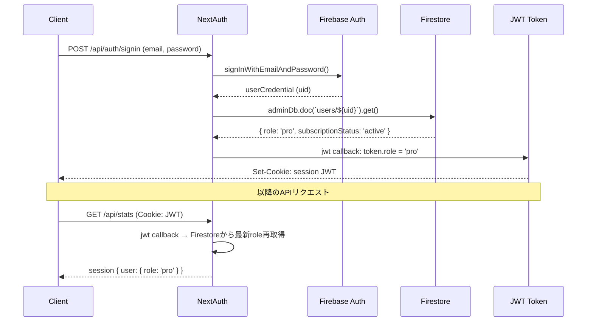
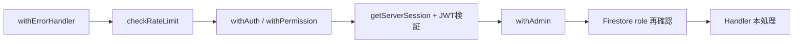

:::message
この記事は「**設計図 × コードで読み解くサービス連携**」シリーズの第1回です。
IT実務3年目のエンジニアを想定し、ポートフォリオの設計図と実コードを照らし合わせながら、サービス間の接続とデータフローを解説します。
AI駆動で開発した自分自身の振り返りも兼ねています。
:::

> 🔗 **インタラクティブ設計図**: [認証・課金タブを見る](https://seiryuu-portfolio.vercel.app/projects/darts-lab)

---

## 1. 設計図で見る全体像

このアプリの認証は **3つのサービスが連携** して成立しています。

```
┌──────────┐     JWT発行      ┌──────────┐    認証実行     ┌──────────────┐
│  Client  │ ──────────────▶ │ NextAuth │ ────────────▶ │ Firebase Auth │
└──────────┘                  └──────────┘                └──────────────┘
     │                             │                            │
     │ APIリクエスト(JWT付)        │ role取得                    │ request.auth
     ▼                             ▼                            ▼
┌──────────────┐          ┌──────────────┐           ┌─────────────────┐
│ API Routes   │          │  Firestore   │           │ Security Rules  │
│ (middleware) │          │ users/{uid}  │           │ (認可ガード)     │
└──────────────┘          └──────────────┘           └─────────────────┘
```

設計図の「認証タブ」を開くと、この3者の接続がインタラクティブに確認できます。

---

## 2. この記事の重要用語

| 用語 | 一言説明 | この記事での役割 |
|------|---------|----------------|
| **JWT** (JSON Web Token) | サーバーが発行する「身分証明書」。ヘッダー.ペイロード.署名の3パート | NextAuth がログイン時に発行し、API リクエストのたびに検証 |
| **CredentialsProvider** | NextAuth のログイン方式の一つ。メール+パスワードで認証 | Firebase Auth を内部で呼び出して認証結果を JWT に変換 |
| **Security Rules** | Firestore への直接アクセスを制御するルール定義 | クライアントから role を書き換えられないようブロック |
| **RBAC** (Role-Based Access Control) | ロール（役割）に基づくアクセス制御 | general / pro / admin の3段階で機能を出し分け |
| **ミドルウェア合成** | 複数の前処理を関数で重ねがけする設計パターン | `withErrorHandler(withPermission(fn, msg, handler), label)` |
| **stale（古い）token** | JWT 発行後にサーバー側でデータが変わり、JWT の中身が古くなること | Stripe で PRO 化した直後、JWT がまだ general のまま問題 |

---

## 3. コードで追うデータフロー

### 3-1. ログイン〜JWT発行〜APIアクセスの流れ



### 3-2. authorize: Firebase Auth → Firestore → JWTへ

`lib/auth.ts` の `authorize` 関数が認証のエントリーポイントです。

```typescript
// lib/auth.ts — CredentialsProvider の authorize
async authorize(credentials) {
  if (!credentials?.email || !credentials?.password) return null;
  try {
    // ① Firebase Auth でメール+パスワード認証
    const userCredential = await signInWithEmailAndPassword(
      auth,
      credentials.email,
      credentials.password,
    );
    const user = userCredential.user;

    // ② Firestore から role と subscriptionStatus を取得
    let role: UserRole = 'general';
    let subscriptionStatus: StripeSubscriptionStatus | null = null;
    const userDoc = await adminDb.doc(`users/${user.uid}`).get();
    if (userDoc.exists) {
      role = userDoc.data()?.role || 'general';
      subscriptionStatus = userDoc.data()?.subscriptionStatus || null;
    }

    // ③ NextAuth に返す → JWT の payload に埋め込まれる
    return {
      id: user.uid,
      name: user.displayName,
      email: user.email,
      role,
      subscriptionStatus,
    };
  } catch (error) {
    console.error('Auth error:', error instanceof Error ? error.message : error);
    return null;
  }
},
```

**ポイント**: Firebase Auth は「この人は本人か？」を確認するだけ。role のような **ビジネスロジック上の属性** は Firestore から取得して JWT に埋め込みます。

### 3-3. JWT の stale 問題とその対策

Stripe で PRO に昇格した直後、JWT にはまだ `role: 'general'` が残っています。これが **stale token** 問題です。

```typescript
// lib/auth.ts L52-70 — jwt callback
async jwt({ token, user }) {
  if (user) {
    // 初回ログイン時: authorize の戻り値から設定
    token.sub = user.id;
    token.role = (user as unknown as { role: UserRole }).role;
  } else if (token.sub) {
    // ★ セッション更新時: Firestore から最新の role を再取得
    try {
      const userDoc = await adminDb.doc(`users/${token.sub}`).get();
      if (userDoc.exists) {
        token.role = userDoc.data()?.role || 'general';
        token.subscriptionStatus = userDoc.data()?.subscriptionStatus || null;
      }
    } catch {
      // Firestore読み取りエラー時は既存のroleを維持
    }
  }
  return token;
},
```

`jwt` callback は **セッション参照のたびに** 呼ばれます。`else if (token.sub)` のブロックで Firestore から最新 role を再取得することで、Webhook で role が変わった次のリクエストから即座に反映されます。

### 3-4. ミドルウェア合成パターン



API Routes では関数を重ねがけして **認証 → 認可 → エラーハンドリング** を統一的に適用します。

```typescript
// lib/api-middleware.ts — withAuth: セッション検証 + AuthContext 提供
export function withAuth(handler: HandlerWithAuth): Handler {
  return async (req: NextRequest) => {
    const session = await getServerSession(authOptions);
    if (!session?.user?.id) {
      return NextResponse.json({ error: '未ログインです' }, { status: 401 });
    }
    return handler(req, {
      userId: session.user.id,
      role: session.user.role || 'general',
      email: session.user.email || null,
    });
  };
}

// withAdmin: withAuth + Firestore で admin を二重チェック
export function withAdmin(handler: HandlerWithAuth): Handler {
  return withAuth(async (req, ctx) => {
    // ★ JWT だけでなく Firestore を再確認（JWT改ざん対策）
    const adminDoc = await adminDb.doc(`users/${ctx.userId}`).get();
    if (!adminDoc.exists || adminDoc.data()?.role !== 'admin') {
      return NextResponse.json({ error: '権限がありません' }, { status: 403 });
    }
    return handler(req, { ...ctx, role: 'admin' });
  });
}
```

**使用例**（実際のAPIルートでの合成）:

```typescript
// app/api/stripe/checkout/route.ts
export const POST = withErrorHandler(
  withAuth(async (_req, { userId, role, email }) => {
    if (isPro(role)) {
      return NextResponse.json({ error: '既にPROプランです' }, { status: 400 });
    }
    // ... checkout session 作成
  }),
  'Stripe checkout error',
);
```

### 3-5. 権限判定関数（関数ベースRBAC）

```typescript
// lib/permissions.ts — 関数ベースの権限判定
export function isPro(role: UserRole | undefined): boolean {
  return role === 'pro' || role === 'admin';
}

export function canUseDartslive(role: UserRole | undefined): boolean {
  return role === 'pro' || role === 'admin';
}

export function getSettingsLimit(role: UserRole | undefined): number | null {
  if (role === 'pro' || role === 'admin') return null; // 無制限
  return SETTINGS_LIMIT_GENERAL; // 1
}
```

admin は常に pro 互換。3段階のロール（general / pro / admin）に対して、**機能ごとに関数を定義** する設計です。

### 3-6. Firestore Security Rules — 最後の砦

```javascript
// firestore.rules — users ドキュメントの update ルール
match /users/{userId} {
  allow update: if isAdmin()
                || (isOwner(userId)
                    && !request.resource.data.diff(resource.data).affectedKeys()
                        .hasAny(['role', 'stripeCustomerId', 'subscriptionId',
                                 'subscriptionStatus', 'subscriptionCurrentPeriodEnd',
                                 'subscriptionTrialEnd',
                                 'xp', 'level', 'rank', 'achievements']));
}
```

`diff().affectedKeys().hasAny(...)` で、クライアントから **role / stripe関連 / XP関連** フィールドが変更されていたら拒否します。これらは Admin SDK（サーバーサイド）経由でのみ書き込み可能です。

---

## 4. 設計判断の背景

### なぜ NextAuth と Firebase Auth の両方が必要か

| 役割 | NextAuth | Firebase Auth |
|------|----------|---------------|
| **セッション管理** | JWT ベースのセッションを API Routes に提供 | - |
| **Firestore 認可** | - | `request.auth` で Security Rules が動く |
| **role 管理** | JWT の payload に role を埋め込み | uid を提供するだけ |

NextAuth だけでは Firestore Security Rules の `request.auth` が使えず、Firebase Auth だけでは API Routes のセッション管理が煩雑になります。**両方を組み合わせることで、APIとFirestore両方の認可を統一的に扱える**のがこの設計のメリットです。

### なぜ withAdmin は JWT だけでなく Firestore を再確認するか

JWT は **クライアント側に保存される** ため、理論上は改ざんのリスクがあります。管理者操作（ユーザー削除、設定変更など）は影響範囲が大きいため、JWT の role だけを信頼せず、**Firestore の最新データでダブルチェック** しています。

### 全ページ `'use client'` の判断背景

このアプリは全コンポーネントが Client Component です。理由は:

- MUI（Material UI）が Client Component 前提
- リアルタイムなスタッツ表示や状態管理が多い
- Server Components との境界管理コストが開発速度を下げると判断

トレードオフとして初回ロード時の JS バンドルは大きくなりますが、SaaS アプリとしてはログイン後の操作性を優先しました。

---

## 5. 本（Book）との対応

この記事の内容は以下の章で詳しく解説しています:

- **第3章「技術選定 — なぜ Next.js × Firebase × Vercel か」**: デュアル認証を採用した技術的背景
- **第5章「認証・課金の設計 — NextAuth × Firebase Auth × Stripe」**: 3段階ロール（general / pro / admin）の設計判断、JWT callback の stale 問題と解決策

> 📘 [Zenn Book: AI × 個人開発で67,000行のSaaSを作った方法](https://zenn.dev/seiryuuu_dev/books/claude-code-darts-lab)

---

:::message
**次の記事**: [Stripe Webhook → ロール昇格の全経路](https://zenn.dev/seiryuuu_dev/articles/darts-lab-stripe-flow) — 決済完了からPRO機能解放までのデータフローを追います。
:::
