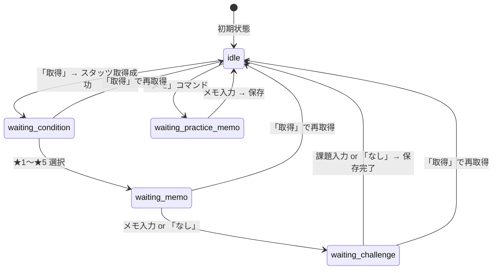
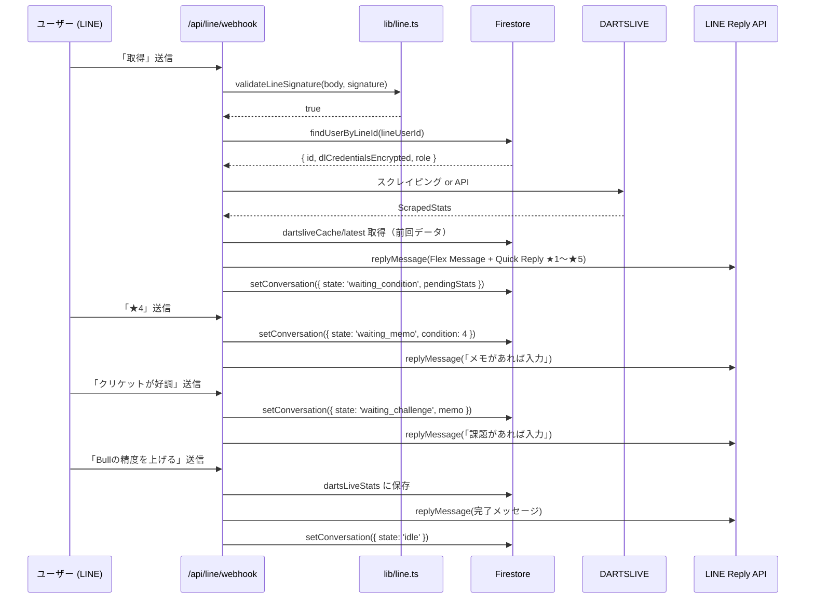

:::message
この記事は「**設計図 × コードで読み解くサービス連携**」シリーズの第4回です。
LINE Bot が Webhook を受信し、Firestore でステートマシンを管理しながらスタッツ取得 → コンディション入力 → メモ → 保存の対話フローを実現する仕組みを追います。
:::

> 🔗 **インタラクティブ設計図**: [API・データフロータブを見る](https://seiryuu-portfolio.vercel.app/projects/darts-lab)

---

## 1. 設計図で見る全体像

```
LINE Platform ──POST──▶ /api/line/webhook
  → lib/line.ts (HMAC-SHA256 署名検証)
  → lineConversations/{lineUserId} (Firestore ステートマシン)
  → lib/dartslive-scraper.ts or lib/dartslive-api.ts (外部データ取得)
  → lib/line.ts (Flex Message / Quick Reply 返信)
```

---

## 2. この記事の重要用語

| 用語 | 一言説明 | この記事での役割 |
|------|---------|----------------|
| **ステートマシン（状態機械）** | 「今どの状態か」に応じて次の動作が変わる設計パターン | LINE Bot が「今何を聞いている最中か」を管理 |
| **HMAC-SHA256** | 共有秘密鍵でメッセージの改ざんを検出するハッシュ方式 | LINE からの Webhook が本物か検証する仕組み |
| **timingSafeEqual** | 比較にかかる時間が常に一定の比較関数 | タイミング攻撃（処理時間の差で情報を推測する手法）を防止 |
| **Flex Message** | LINE の高度なメッセージ形式。JSON でカード型レイアウトを定義 | スタッツ通知のリッチな表示に使用 |
| **Quick Reply** | LINE メッセージ下部に表示される選択ボタン | コンディション入力 ★1〜★5 の選択 UI |
| **replyToken** | LINE が Webhook と一緒に送る「返信権」。30秒で失効 | 即時返信が必要な場面で使用（vs Push は任意タイミング） |
| **TTL（Time To Live）** | データの有効期限 | `lineLinkCodes` の8桁コードは10分で失効 |

---

## 3. コードで追うデータフロー

### 3-1. ステートマシンの状態遷移



各状態で Bot が **何を待っているか**:

| 状態 | 待っている入力 | 次の状態 |
|------|-------------|---------|
| `idle` | 「取得」「メモ」「ヘルプ」 or 8桁コード | → `waiting_condition` / `waiting_practice_memo` |
| `waiting_condition` | ★1〜★5 | → `waiting_memo` |
| `waiting_memo` | メモテキスト or 「なし」 | → `waiting_challenge` |
| `waiting_challenge` | 課題テキスト or 「なし」 | → `idle`（保存完了） |
| `waiting_practice_memo` | メモテキスト | → `idle`（次回Cronに紐づけ） |

### 3-2. ユーザーが「取得」を送信してからの全フロー



### 3-3. HMAC-SHA256 署名検証

```typescript
// lib/line.ts — 署名検証
export function validateLineSignature(body: string, signature: string): boolean {
  const secret = process.env.LINE_CHANNEL_SECRET;
  if (!secret) return false;

  // ① リクエストボディを HMAC-SHA256 でハッシュ
  const hash = createHmac('sha256', secret).update(body).digest('base64');

  try {
    // ② timingSafeEqual で比較（タイミング攻撃防止）
    return timingSafeEqual(
      Buffer.from(hash, 'base64'),
      Buffer.from(signature, 'base64'),
    );
  } catch {
    return false;
  }
}
```

**なぜ `timingSafeEqual` か**: 通常の `===` 比較は、最初の不一致文字で即座に `false` を返します。攻撃者はレスポンス時間の差を測定して、正しい署名を1文字ずつ推測できます（**タイミング攻撃**）。`timingSafeEqual` は比較にかかる時間が入力に関わらず一定なため、この攻撃を防ぎます。

### 3-4. Webhook ルート — イベントルーティング

```typescript
// app/api/line/webhook/route.ts
export async function POST(request: NextRequest) {
  const rawBody = await request.text();
  const signature = request.headers.get('x-line-signature') || '';

  // 署名検証
  if (!validateLineSignature(rawBody, signature)) {
    return NextResponse.json({ error: 'Invalid signature' }, { status: 403 });
  }

  const body = JSON.parse(rawBody);
  const events: LineEvent[] = body.events || [];

  for (const event of events) {
    const lineUserId = event.source?.userId;
    if (!lineUserId) continue;

    try {
      if (event.type === 'follow') {
        await handleFollow(event, lineUserId);        // 友だち追加
      } else if (event.type === 'unfollow') {
        await handleUnfollow(lineUserId);              // ブロック/削除
      } else if (event.type === 'message' && event.message?.type === 'text') {
        await handleTextMessage(event, lineUserId, event.message.text || '');
      }
    } catch (err) {
      console.error('Webhook event error:', err);
      // ★ 1つのイベント失敗で他のイベントが止まらない
    }
  }

  return NextResponse.json({ ok: true });
}
```

### 3-5. ステートマシン — Firestore で状態管理

```typescript
// 会話状態を取得
async function getConversation(lineUserId: string) {
  const ref = adminDb.doc(`lineConversations/${lineUserId}`);
  const snap = await ref.get();
  if (!snap.exists)
    return { state: 'idle', pendingStats: null, condition: null, memo: null, pendingMemo: null };
  return snap.data() as {
    state: 'idle' | 'waiting_condition' | 'waiting_memo'
         | 'waiting_challenge' | 'waiting_practice_memo';
    pendingStats: Record<string, unknown> | null;
    condition: number | null;
    memo: string | null;
    pendingMemo: string | null;
  };
}

// 会話状態を更新
async function setConversation(lineUserId: string, data: Record<string, unknown>) {
  const ref = adminDb.doc(`lineConversations/${lineUserId}`);
  await ref.set({ ...data, updatedAt: FieldValue.serverTimestamp() }, { merge: true });
}
```

`lineConversations/{lineUserId}` ドキュメント1つで「今何を聞いている最中か」を管理します。

### 3-6. テキストメッセージ処理の分岐

```typescript
async function handleTextMessage(event: LineEvent, lineUserId: string, text: string) {
  const trimmed = text.trim();

  // 8桁コード → アカウント連携（どの状態でも受け付ける）
  if (isLinkCode(trimmed)) {
    await handleLinkCode(event.replyToken, lineUserId, trimmed);
    return;
  }

  // 「取得」→ どの状態からでも再取得可能（状態リセット）
  if (trimmed === '取得') {
    await setConversation(lineUserId, { state: 'idle', ... });
    await handleFetchStats(event.replyToken, lineUserId);
    return;
  }

  // 会話状態に応じた処理
  const conv = await getConversation(lineUserId);

  if (conv.state === 'waiting_condition') {
    const condition = parseCondition(trimmed); // ★1〜★5 を抽出
    if (!condition) {
      await replyLineMessage(event.replyToken, [
        { type: 'text', text: '★1〜★5 から選んでください。', quickReply: { ... } },
      ]);
      return;
    }
    await setConversation(lineUserId, { state: 'waiting_memo', condition });
    // ...
  }

  if (conv.state === 'waiting_memo') {
    const memo = trimmed === 'なし' ? '' : trimmed;
    await setConversation(lineUserId, { state: 'waiting_challenge', memo });
    // ...
  }

  if (conv.state === 'waiting_challenge') {
    const challenge = trimmed === 'なし' ? '' : trimmed;
    // ★ dartsLiveStats に保存して完了
    await adminDb.collection(`users/${user.id}/dartsLiveStats`).add({
      date: stats.date, rating: stats.rating,
      condition, memo, challenge,
      createdAt: FieldValue.serverTimestamp(),
    });
    await setConversation(lineUserId, { state: 'idle', ... });
  }
}
```

### 3-7. アカウント連携（8桁コード）

```typescript
async function handleLinkCode(replyToken: string, lineUserId: string, code: string) {
  const codeRef = adminDb.doc(`lineLinkCodes/${code}`);
  const codeSnap = await codeRef.get();

  if (!codeSnap.exists) {
    await replyLineMessage(replyToken, [{ type: 'text', text: 'コードが見つかりません。' }]);
    return;
  }

  // ★ 有効期限チェック（10分 TTL）
  const expiresAt = codeData.expiresAt?.toDate?.();
  if (expiresAt && expiresAt < new Date()) {
    await codeRef.delete();
    await replyLineMessage(replyToken, [{ type: 'text', text: '有効期限が切れています。' }]);
    return;
  }

  // ユーザーに lineUserId を紐づけ
  await adminDb.doc(`users/${userId}`).update({
    lineUserId,
    lineNotifyEnabled: true,
  });
  await codeRef.delete(); // コード使い捨て
}
```

連携フロー: Web で8桁コード発行 → LINE で送信 → `lineLinkCodes/{code}` で突合 → `users/{uid}` に `lineUserId` 設定

### 3-8. Flex Message + Quick Reply

```typescript
// lib/line.ts — buildStatsFlexMessage（抜粋）
export function buildStatsFlexMessage(stats: { ... }): object {
  return {
    type: 'flex',
    altText: `リザルト: Rt.${ratingStr} / PPD ${ppdStr} / MPR ${mprStr}`,
    contents: {
      type: 'bubble',
      header: { /* Darts Lab ブランドヘッダー */ },
      body: {
        /* Rating (フライトカラー表示) + PPD + MPR */
        /* ▲+0.15 / ▼-0.03 の差分色分け */
        /* AWARDS セクション（差分のみ表示） */
        /* 「調子はどうでしたか？」 */
      },
    },
    // ★ Quick Reply: メッセージ下部に ★1〜★5 ボタン
    quickReply: {
      items: [1, 2, 3, 4, 5].map((n) => ({
        type: 'action',
        action: { type: 'message', label: `★${n}`, text: `★${n}` },
      })),
    },
  };
}
```

---

## 4. 設計判断の背景

### なぜ Firestore でステートマシンを実装するか

Vercel Serverless Functions は **ステートレス** です。リクエストが終わるとメモリは破棄されます。
インメモリで会話状態を持つことはできないため、**Firestore をステートストアとして使う**のが唯一の選択肢です。

| 方式 | サーバーフル | サーバーレス (Vercel) |
|------|-----------|---------------------|
| インメモリ Map | 可能（プロセス常駐） | **不可**（リクエスト毎に破棄） |
| Redis | 可能（TTL付き） | 可能だがコスト増 |
| Firestore | 可能 | **採用**（既に使用中） |

### Push vs Reply の使い分け

| 方式 | 特徴 | 使用場面 |
|------|------|---------|
| **Reply** (replyToken) | Webhook 応答のみ。30秒で失効。無料。 | ユーザーの操作に即座に返信 |
| **Push** | 任意タイミングで送信可能。月額プラン外は有料。 | Cron からの毎朝通知 |

Cron バッチからの通知は `sendLinePushMessage`（Push）、ユーザーのメッセージへの応答は `replyLineMessage`（Reply）を使い分けます。

### 「取得」コマンドの特別扱い

どの状態（waiting_condition, waiting_memo, waiting_challenge）からでも「取得」と送信すると **状態がリセットされて再取得** できます。入力途中でやり直したい場合の **エスケープハッチ** です。

---

## 5. 本（Book）との対応

- **第6章「Firestore 23コレクションの設計判断」**: `lineConversations`, `lineLinkCodes` の設計
- **第7章「AIとペアプロする日常」**: LINE Bot の対話フロー実装での AI との協働

> 📘 [Zenn Book: AI × 個人開発で67,000行のSaaSを作った方法](https://zenn.dev/seiryuuu_dev/books/claude-code-darts-lab)

---

:::message
**次の記事**: [多層防御の実装](https://zenn.dev/seiryuuu_dev/articles/darts-lab-defense-layers) — レートリミット × 認証 × 権限 × Firestore ルールの4層を追います。
:::
