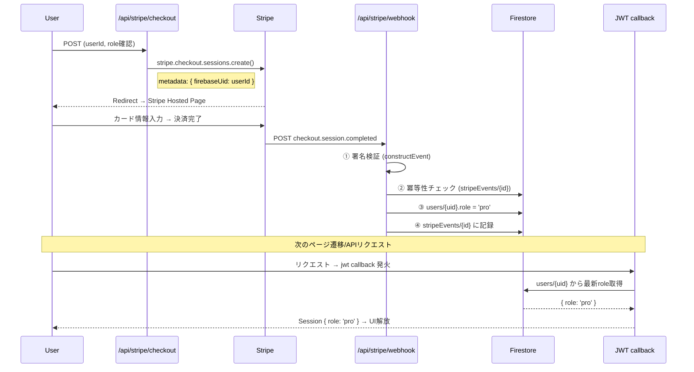
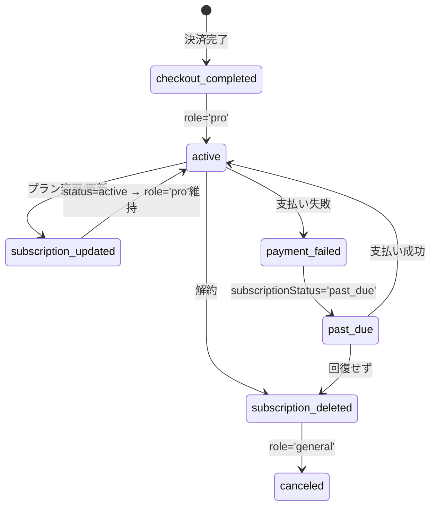
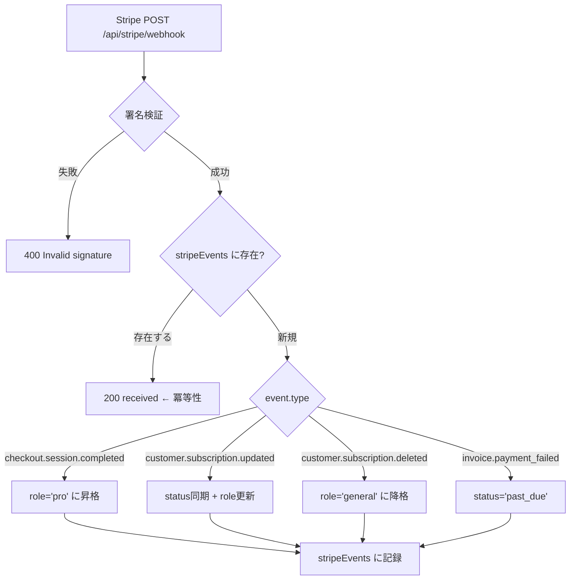

:::message
この記事は「**設計図 × コードで読み解くサービス連携**」シリーズの第2回です。
IT実務3年目のエンジニアを想定し、Stripe Webhook がどのようにアプリの role を変更し、PRO機能を解放するかを実コードで追います。
:::

> 🔗 **インタラクティブ設計図**: [認証・課金タブ（課金）を見る](https://seiryuu-portfolio.vercel.app/projects/darts-lab)

---

## 1. 設計図で見る全体像

決済〜PRO反映の全経路は **5つのサービスを横断** します。

```
User ──▶ /api/stripe/checkout ──▶ Stripe Hosted Page ──▶ Payment
                                          │
                                          ▼
         Stripe Platform ──POST──▶ /api/stripe/webhook ──▶ Firestore
                                                            (role: 'pro')
                                          │
                                          ▼
         Next request ──▶ JWT callback ──▶ Firestore role再取得
                                          │
                                          ▼
                              Session { role: 'pro' } ──▶ UI解放
```

---

## 2. この記事の重要用語

| 用語 | 一言説明 | この記事での役割 |
|------|---------|----------------|
| **Webhook** | 外部サービスが「イベント発生時に自分のサーバーへ POST する」仕組み | Stripe が決済完了/解約等を通知してくる経路 |
| **冪等性** (Idempotency) | 同じ処理を何回実行しても結果が変わらない性質 | Stripe の再送で二重課金・二重昇格を防ぐ |
| **署名検証** (Signature Verification) | リクエストが本物の送信元から来たか暗号的に検証すること | `constructEvent()` で Stripe 偽装を防止 |
| **Checkout Session** | Stripe が提供する決済画面のセッション。metadata を付与可能 | `firebaseUid` を埋め込み、Webhook で誰の決済か特定 |
| **Subscription Lifecycle** | サブスクの状態遷移: active → past_due → canceled | 4つの Webhook イベントで Firestore の role を同期 |
| **PCI DSS** | クレジットカード業界のセキュリティ基準 | Stripe に委託することで自前実装を回避 |

---

## 3. コードで追うデータフロー

### 3-1. 決済〜PRO反映の全経路



### 3-2. Checkout Session 作成（metadata が鍵）

```typescript
// app/api/stripe/checkout/route.ts
export const POST = withErrorHandler(
  withAuth(async (_req, { userId, role, email }) => {
    if (isPro(role)) {
      return NextResponse.json({ error: '既にPROプランです' }, { status: 400 });
    }

    const stripe = getStripe();
    // ... Customer 取得/作成 ...

    // ★ metadata に firebaseUid を埋め込む
    const checkoutSession = await stripe.checkout.sessions.create({
      customer: customerId,
      mode: 'subscription',
      payment_method_types: ['card'],
      line_items: [{ price: priceId, quantity: 1 }],
      subscription_data: {
        trial_period_days: trialDays,
        metadata: { firebaseUid: userId },
      },
      success_url: `${origin}/profile/subscription?success=1`,
      cancel_url: `${origin}/pricing?canceled=1`,
      metadata: { firebaseUid: userId }, // ← ここが Webhook で使われる
    });

    return NextResponse.json({ url: checkoutSession.url });
  }),
  'Stripe checkout error',
);
```

**ポイント**: Stripe の世界には Firebase の uid は存在しません。`metadata.firebaseUid` で **Stripe → Firebase の橋渡し** をしています。

### 3-3. Webhook 受信 — 署名検証 → 冪等性 → イベント振り分け

```typescript
// app/api/stripe/webhook/route.ts
export async function POST(request: NextRequest) {
  const rawBody = await request.text();
  const signature = request.headers.get('stripe-signature') || '';

  // ① 署名検証 — Stripe の秘密鍵で署名を確認
  const stripe = getStripe();
  let event: Stripe.Event;
  try {
    event = stripe.webhooks.constructEvent(rawBody, signature, webhookSecret);
  } catch (err) {
    console.error('Webhook signature verification failed:', err);
    return NextResponse.json({ error: 'Invalid signature' }, { status: 400 });
  }

  // ② 冪等性チェック — stripeEvents コレクションで重複排除
  const eventRef = adminDb.doc(`stripeEvents/${event.id}`);
  const eventDoc = await eventRef.get();
  if (eventDoc.exists) {
    return NextResponse.json({ received: true }); // 処理済み → 200で返す
  }

  // ③ イベント振り分け
  try {
    switch (event.type) {
      case 'checkout.session.completed':
        await handleCheckoutCompleted(event.data.object as Stripe.Checkout.Session);
        break;
      case 'customer.subscription.updated':
        await handleSubscriptionUpdated(event.data.object as Stripe.Subscription);
        break;
      case 'customer.subscription.deleted':
        await handleSubscriptionDeleted(event.data.object as Stripe.Subscription);
        break;
      case 'invoice.payment_failed':
        await handlePaymentFailed(event.data.object as Stripe.Invoice);
        break;
    }

    // ④ 処理済みイベントを記録
    await eventRef.set({
      type: event.type,
      processedAt: Timestamp.now(),
    });
  } catch (err) {
    console.error(`Webhook handler error for ${event.type}:`, err);
    return NextResponse.json({ error: 'Webhook handler failed' }, { status: 500 });
  }

  return NextResponse.json({ received: true });
}
```

### 3-4. サブスクリプションのライフサイクル



### 3-5. 各イベントハンドラの実装

**handleCheckoutCompleted** — PRO昇格:

```typescript
async function handleCheckoutCompleted(session: Stripe.Checkout.Session) {
  const firebaseUid = session.metadata?.firebaseUid;
  if (!firebaseUid) return;

  const subscription = await stripe.subscriptions.retrieve(subscriptionId);
  const periodEnd = getSubscriptionPeriodEnd(subscription);

  // ★ Firestore の role を 'pro' に更新
  await adminDb.doc(`users/${firebaseUid}`).update({
    role: 'pro',
    subscriptionId: subscription.id,
    subscriptionStatus: subscription.status,
    subscriptionCurrentPeriodEnd: periodEnd ? Timestamp.fromDate(periodEnd) : null,
  });
}
```

**handleSubscriptionDeleted** — ダウングレード:

```typescript
async function handleSubscriptionDeleted(subscription: Stripe.Subscription) {
  const firebaseUid = await getFirebaseUidFromCustomer(customerId);
  if (!firebaseUid) return;

  // 手動PRO設定ユーザー（subscriptionId=null）はダウングレードしない
  if (!userData?.subscriptionId) return;

  // ★ role を 'general' に戻す
  await adminDb.doc(`users/${firebaseUid}`).update({
    role: 'general',
    subscriptionStatus: 'canceled',
    subscriptionId: null,
  });
}
```

**handlePaymentFailed** — 支払い失敗（role は変えない）:

```typescript
async function handlePaymentFailed(invoice: Stripe.Invoice) {
  const firebaseUid = await getFirebaseUidFromCustomer(customerId);
  if (!firebaseUid) return;

  // role はそのまま、status だけ更新
  await adminDb.doc(`users/${firebaseUid}`).update({
    subscriptionStatus: 'past_due',
  });
}
```

### 3-6. Webhook 受信→署名検証→冪等性→分岐の処理フロー



### 3-7. role 反映のタイミング（JWT refresh）

Webhook で Firestore の role が変わっても、ユーザーのブラウザにはまだ古い JWT が残っています。
**次のリクエスト時に** `jwt` callback が Firestore から最新 role を再取得する設計です（[記事1で解説](https://zenn.dev/seiryuuu_dev/articles/darts-lab-dual-auth)）。

```typescript
// lib/auth.ts — jwt callback（毎リクエスト実行）
async jwt({ token, user }) {
  if (user) {
    token.role = user.role; // 初回ログイン
  } else if (token.sub) {
    // ★ Firestore から最新 role を取得 → PRO が即反映
    const userDoc = await adminDb.doc(`users/${token.sub}`).get();
    if (userDoc.exists) {
      token.role = userDoc.data()?.role || 'general';
    }
  }
  return token;
},
```

---

## 4. 設計判断の背景

### なぜ Webhook 駆動か（ポーリング vs Webhook）

| 方式 | メリット | デメリット |
|------|---------|-----------|
| **ポーリング** | 実装がシンプル | APIコール数に応じた課金、リアルタイム性が低い |
| **Webhook** | イベント発生時に即通知、API呼び出し不要 | エンドポイントの実装・セキュリティ対策が必要 |

Stripe は Webhook を **推奨アーキテクチャ** としています。決済完了の通知が数秒以内に届き、ポーリングの定期実行コストも不要です。

### 冪等性がなぜ必須か

Stripe は Webhook の配信に失敗した場合、**最大72時間にわたり再送** します。冪等性がないと:

- 同じ `checkout.session.completed` が2回来て、処理が重複する
- ログやポイント付与が二重になるリスク

`stripeEvents/{event.id}` で処理済みを記録し、2回目以降は `200 OK` で即返却する設計です。

### Stripe v20+ の breaking change

```typescript
// Stripe v20+ では current_period_end が Subscription ではなく
// SubscriptionItem にある
function getSubscriptionPeriodEnd(subscription: Stripe.Subscription): Date | null {
  const item = subscription.items?.data?.[0];
  if (item?.current_period_end) {
    return new Date(item.current_period_end * 1000);
  }
  return null;
}
```

Stripe SDK のメジャーバージョンアップで `subscription.current_period_end` が移動しました。この専用ヘルパー関数で吸収しています。

---

## 5. 本（Book）との対応

- **第5章「認証・課金の設計」**: 4つの Webhook イベント、冪等性の設計、Checkout Session の metadata 戦略を解説
- **第3章「技術選定」**: Stripe を選んだ理由（PCI DSS 準拠、Hosted Page でカード情報を自前管理しない）

> 📘 [Zenn Book: AI × 個人開発で67,000行のSaaSを作った方法](https://zenn.dev/seiryuuu_dev/books/claude-code-darts-lab)

---

:::message
**次の記事**: [6サービスが協調するCronバッチ](https://zenn.dev/seiryuuu_dev/articles/darts-lab-cron-pipeline) — 毎朝10時に走る9ステップの実装を追います。
:::
